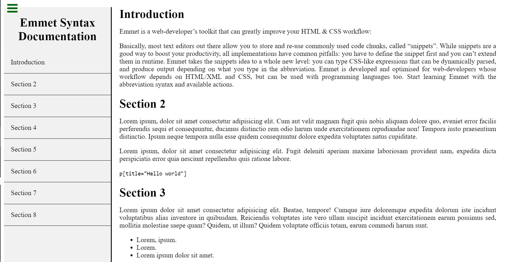

# Ben-King Review

> In this project, I had to perform a code review of a past project. This simple project was built 5 months ago through pair-programming. Back then, I wasn't yet aware of all the good practices like documenting repos professionally, using tools like Linter, Webhint, choosing semantic tags in HTML, writing good commit messages etc. Now that I know more about those best practices, I was asked to play the role of a Code Reviewer on this old project. 

> I was supposed to open a new Pull Request (PR), check this previous code and write a good code review following the recommended steps. 

In this project, [@BenMukebo](https://github.com/BenMukebo) and I were paired in the Microverse Admission Process, and together we had to build a page that would be functionally similar to [this example from CodePen](https://github.com/Kingjosh007).

## Screenshot

## Built With

- HTML, CSS

## Live Demo

There is no live demo available for this project. I provided a screenshot instead.

## Authors

👤 **King Josaphat Chewa (KJC)**

- GitHub: [@Kingjosh007](https://github.com/Kingjosh007)
- Twitter: [@KingJoChewa](https://twitter.com/KingJoChewa)
- LinkedIn: [LinkedIn](https://www.linkedin.com/in/king-josaphat-chewa-aa154011b/)

👤 **Ben Mukebo Kasongo**

- GitHub: [@BenMukebo](https://github.com/BenMukebo)

## 🤝 Contributing

Contributions, issues, and feature requests are welcome!

Feel free to check the [issues page](../../issues/).

## Show your support

Give a ⭐️ if you like this project!

## Acknowledgments

- Microverse
- Ben Mukebo Kasongo

## 📝 License

This project is [MIT](./MIT.md) licensed.
